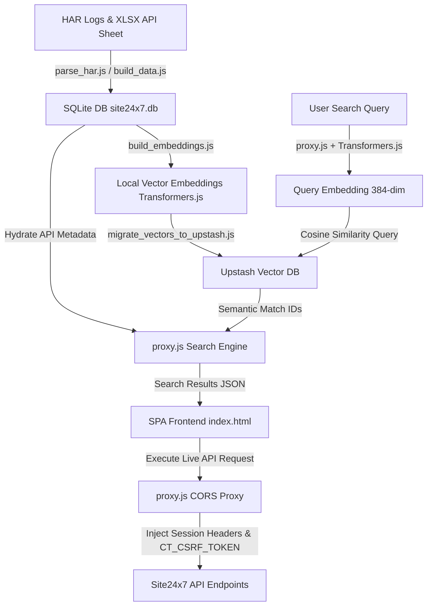

# Site24x7 AI-Powered API Search Platform

Semantic search and live execution interface over ~2,528 Site24x7 API endpoints across 16 categories.

## Overview

The Site24x7 AI-Powered API Search Platform is a self-contained developer tool designed to accelerate API integration, debugging, and testing. By mapping Zoho Site24x7 Admin and Reports API endpoints into a unified directory, it provides developers with a high-performance single-page application (SPA) to explore, search, and run API requests directly from their web browser.

Traditional keyword search fails when developers don't know the exact endpoint names. This platform overcomes that by embedding a hybrid search engine: local text-based TF-IDF matching for precise technical queries, and cloud-hosted dense vector similarity matching for conceptual queries (e.g., searching "alert rules" matches "notification profiles"). Authorized API calls are securely tunneled through a local Node.js proxy to circumvent cross-origin restrictions (CORS) and inject authentication headers automatically.

## Key Features

- **Semantic AI Search:** Leverage 384-dimensional dense vectors generated by Transformers.js (`all-MiniLM-L6-v2`) and hosted on Upstash Vector to find APIs by conceptual intent rather than exact wording.
- **Local TF-IDF Search:** Perform traditional search using a local pre-computed index for exact keyword matching, technical parameters, or HTTP verbs.
- **Relational Metadata Store:** Power index data, endpoint descriptions, execution statistics, and search logs using SQLite (`better-sqlite3`).
- **Live CORS-Free Testing Proxy:** Tunnel requests to Site24x7's servers safely, automating cookie injection, authorization header formatting, and Zoho's CSRF token extraction.
- **Conversational RAG Chat Agent:** Generate payload schemas and query structures in an interactive drawer powered by OpenAI / Azure OpenAI models using dynamically injected RAG context.
- **Zero-Dependency UI:** A custom-built, responsive single-page application with lazy rendering to maintain a lightweight footprint and 60 FPS scrolling speeds.

## Screenshots


*Figure 1: The primary dashboard displaying semantic search results, endpoint details, and category filters.*


*Figure 2: The endpoint inspector displaying sample payloads, parameter configuration fields, and live execution consoles.*


*Figure 3: RAG-fueled AI chat assistant suggesting endpoints and preparing custom JSON body structures.*

### Screenshots to Capture

For this repository, please capture the following screens and place them in `docs/screenshots/`:
1. **`search-home.png`**: A screenshot of the main dashboard after running a search query (e.g., "website settings").
2. **`live-testing.png`**: A screenshot showing an expanded endpoint card with filled request payload parameters and proxy execution results.
3. **`ai-chat-agent.png`**: A screenshot showing the sidebar chat panel after asking the AI Agent how to perform a mutation.

## Architecture

The workflow starts with offline raw data parsing (HAR files and Excel sheets) and converts them into structured SQLite databases and pre-computed embeddings. At runtime, the user triggers searches that query Upstash Vector and SQLite, presenting the results in the web UI. Requests executed from the browser are tunneled back to Site24x7 APIs via the proxy server.



## Tech Stack

| Component | Technologies | Purpose |
|---|---|---|
| **Frontend UI** | Vanilla HTML5, CSS3, ES6 JavaScript | Lightweight, zero-dependency SPA with lazy DOM rendering |
| **Backend Proxy** | Node.js, `http`, `https`, `dotenv` | Tunnels requests, bypasses CORS, hosts the static server, routes search APIs |
| **Vector Embedding** | Transformers.js (`all-MiniLM-L6-v2`) | Generates local text embeddings offline or online on demand |
| **Vector Store** | Upstash Vector | Cloud-native serverless vector database running low-latency cosine similarity |
| **Metadata Database** | SQLite (`better-sqlite3`) | Stores rich schema tables, query logs, category metadata, and correctness metrics |
| **Containerization** | Docker, Docker Compose | Bundles proxy, static UI, and optional backing services |

## Getting Started

### Prerequisites

- **Node.js** v18+ and `npm`
- **Upstash Account** with an active Vector Index (Dimension: 384, Metric: Cosine)
- **Docker Desktop** (optional, for running in isolated containers)

### Installation

1. Clone the repository and navigate to the project directory:
   ```bash
   git clone <repository-url>
   cd AI-Testing-Site24x7-Final
   ```

2. Install dependencies:
   ```bash
   npm install
   ```

3. Initialize the environment configuration file:
   ```bash
   cp .env.example .env
   ```

### Configuration (`.env` Variables)

Modify the `.env` file with your credentials:

```ini
# Local server port for the API proxy
PROXY_PORT=3334

# Allowed origin for CORS validation
ALLOWED_ORIGIN=http://localhost:3333

# Upstash Vector credentials
UPSTASH_VECTOR_REST_URL="https://your-index-vector.upstash.io"
UPSTASH_VECTOR_REST_TOKEN="ABUFMHJlZmlu..."

# LLM provider settings for RAG Agent
LLM_PROVIDER=openai
OPENAI_BASE_URL="https://your-openai-endpoint/v1"
OPENAI_API_KEY="your-api-key"
OPENAI_MODEL="gpt-4"
```

### Data Pipeline Setup

To populate your SQLite database and Upstash vector index with the Site24x7 dataset:

```bash
# 1. Parse Excel data and build SQLite tables
node build_data.js
node migrate_master_to_sqlite.js

# 2. Extract embeddings and migrate to Upstash Vector
node build_embeddings.js
node migrate_vectors_to_upstash.js
```

### Running the Application

Start the local server and proxy:

```bash
# Builds UI assets and runs the client (3333) and proxy (3334)
npm run dev
```

Alternatively, launch using Docker:

```bash
docker-compose up -d --build
```

Access the user interface at: [http://localhost:3333](http://localhost:3333)

## Usage Example

### Query Request

Query the local semantic endpoint to find profiles related to email notifications:

```bash
curl -X GET "http://localhost:3334/semantic_search?q=email+notification+settings"
```

### Response Payload

The backend returns matching API IDs ranked by similarity score:

```json
[
  {
    "id": 1402,
    "score": 0.8427
  },
  {
    "id": 1405,
    "score": 0.7931
  },
  {
    "id": 1411,
    "score": 0.7104
  }
]
```
*Note: The frontend UI interceptor hydrates these IDs with full descriptions, parameters, and endpoints fetched from SQLite.*

## Project Structure

```
├── Dockerfile                      # Builds Node 18-slim container image
├── docker-compose.yml              # Wires proxy and frontend service containers
├── package.json                    # Node.js project manifests and script shortcuts
├── proxy.js                        # Node.js proxy server (handles Upstash queries, RAG Chat, and CORS tunneling)
├── db.js                           # SQLite database connection helper (better-sqlite3)
├── redis_store.js                  # Vector querying handler connecting to Upstash Vector
├── build_data.js                   # Extracts sheet data from the raw xlsx workbook
├── build_embeddings.js             # Generates all-MiniLM-L6-v2 embeddings locally
├── migrate_master_to_sqlite.js     # Seeds SQLite tables from the compiled json files
├── migrate_vectors_to_upstash.js   # Bulk-uploads local vectors to Upstash Vector Index
├── tfidf_index.json                # Pre-calculated term frequencies for exact matches
├── index.html                      # Core single-page application UI (compiled statically)
├── src/
│   ├── client.js                   # Frontend application controller and REST tester
│   ├── styles.css                  # UI layout and interactive presentation system
│   └── template.html               # Build source markup used by generate_html.js
└── docs/
    └── screenshots/                # Application captures (user-supplied)
```

## Security Note

All API secrets, Site24x7 cookies (`JSESSIONID`, `CT_CSRF_TOKEN`), and LLM API keys are handled server-side through local environment variables (`.env`) or forwarded temporarily in-memory. They are never cached on public disks, sent to third-party servers (except directly to the designated Site24x7 and OpenAI endpoints), or leaked to GitHub repositories.

## License

This project is licensed under the MIT License. See the [LICENSE](LICENSE) file for details.
